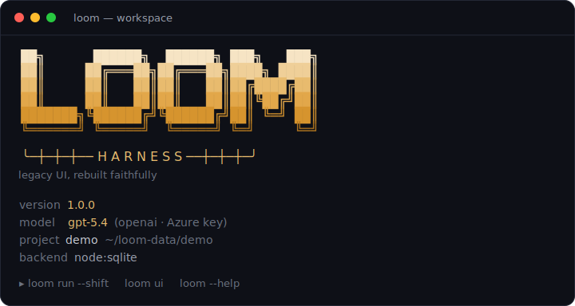
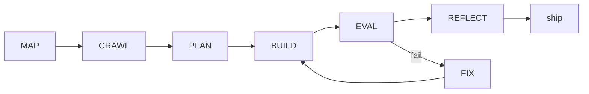

<p align="center">
  <picture>
    <source media="(prefers-color-scheme: dark)" srcset="docs/loom-mark-dark.svg" />
    
  </picture>
</p>

<h1 align="center">Loom Harness</h1>

<p align="center"><strong>legacy UI, rebuilt faithfully</strong></p>

<p align="center">
  
</p>

<p align="center">
  Loom Harness maps undocumented legacy apps, rebuilds their screens in modern code,<br/>
  and proves each rebuild is <em>identical</em> to the original.
</p>

<p align="center">
  
  = 20.11" />
  
  
</p>

A reusable, open-source agentic system that **maps undocumented legacy codebases, crawls their running UIs, and rebuilds them in modern stacks** with pixel- and function-faithful parity — verified by an automated, deterministic A/B evaluation. The first target is a Struts 1.x / JSP / Tiles application → React 19 + TypeScript; the harness itself is project-agnostic (everything app-specific lives in a swappable _profile_).

> **Why "Loom"?** We rebuild screen-by-screen the way a loom weaves new cloth from old threads — and in a loom, the **harness** is the part that lifts the threads to form the pattern. The mark is **three keys** (the legacy systems it unlocks) held in a frame and crossed by a single **weft** thread (the modern rebuild woven through). Access, weaving, and a pixel grid — in one glyph.

## What it does

A durable, resumable pipeline takes one screen from legacy source to a proven rebuild:



- **MAP** — custom Struts / Tiles / JSP / web.xml scanners build a CodeAtlas (graph + FTS + PageRank repo-map), then an LLM pass writes the documentation the app never had.
- **CRAWL** — a Playwright surveyor walks the running app (the trusted/production baseline), capturing screenshots, DOM, computed styles, forms, and nav edges; an **AI-explorer** reaches the screens behind menus/tabs/buttons that link-following can't (e.g. a `qpmenu` shell), persisting everything into a UI atlas.
- **PLAN** — a planner emits dependency-ordered work packages (shared layout/components first); a human approves the plan gate.
- **BUILD → EVAL → FIX** — the agent loop writes the rebuild inside a protected `b-repo`, then a **deterministic, LLM-free evaluator** judges it across **seven layers** (visual · structural DOM · computed-style · functional/validation · accessibility · anti-cheat, plus the coverage ledger) so the builder can never argue with the judge.
- **REFLECT → ship** — passed screens distill into reusable SKILL.md skills (screen #50 is faster than screen #5); a human approves the ship gate; integration evals re-run cumulatively so a shared-component change can't silently regress a passed screen.

Runs unattended in **shift mode** with hard safeguards (per-attempt + per-shift budgets, stop-the-line on regression, protected paths, a kill switch), and stays fully observable through **Mission Control** (live workers, pipeline, cost, eval analytics, the gate/question inbox) and OpenTelemetry spans.

## Requirements

- **Node.js ≥ 20.11** (works on 22 and 24)
- **pnpm** (bootstrap with `corepack enable` if absent)
- **git**; **JDK 17** for the fixture app and Java scanners
- No Docker required. SQLite runs natively (`better-sqlite3`) or via Node's built-in `node:sqlite` fallback — whichever loads.

## Quickstart

```bash
git clone https://github.com/ap05-epic/loom-harness && cd loom-harness

# One-shot (recommended, esp. on a pod): installs, builds, puts `loom` on PATH,
# creates a profile outside the clone, and verifies it. Idempotent — re-runnable.
bash scripts/setup-pod.sh            # --base-url … --api-key … to skip the prompts
```

…or by hand:

```bash
corepack enable && pnpm install && pnpm build
pnpm link --global ./packages/cli         # or just call: node packages/cli/dist/bin.js …
loom init                                 # writes the profile to the global home (~/.loom)
# edit ~/.loom/.env  → LLM_BASE_URL (…/openai/v1) + LLM_API_KEY
loom doctor                               # verify the environment
loom chat                                 # talk to it — no flags, no --data-dir
```

**`loom` uses a global home at `~/.loom`** (like Hermes's `~/.hermes`), so **no command needs `--data-dir`** — set it up once, then just run `loom chat`. (Override the location with `LOOM_HOME`, or point at a specific project with `--data-dir`/a workspace.) Models are reached via a **direct OpenAI/Azure key** — `LLM_BASE_URL` (ending in `…/openai/v1`) + `LLM_API_KEY`. `loom chat` drives the harness conversationally — it even interviews you and writes the project config for you (see [how you interact with Loom](docs/concepts/interaction-model.md)). Locked-down environment? See the [Pod runbook](docs/guides/POD-RUNBOOK.md) and the [onboarding playbook](docs/guides/baa-onboarding.md).

## CLI

`loom` is scriptable-first: **every command supports `--json`** (one result envelope on stdout, diagnostics on stderr) and returns a **documented exit code**. Interactive wizards degrade cleanly to flags, so nothing ever hangs in CI or over SSH. Bare `loom` prints a compact dashboard; the one-line mark `│┼│ loom` rides the status line.

| Group        | Commands                                                                                                                                  |
| ------------ | ----------------------------------------------------------------------------------------------------------------------------------------- |
| Lifecycle    | `init` · `doctor` · `status` · `next` · `ask` · `chat` · `update` · `profile show\|validate` · `models list\|test` · `db migrate\|backup` |
| Pipeline     | `map` · `crawl` · `eval` · `run [--shift]` · `resume` · `stop`                                                                            |
| Observe      | `watch` · `logs` · `report` · `ui`                                                                                                        |
| Work & gates | `wp` · `gates` · `questions`                                                                                                              |
| Knowledge    | `skills` · `atlas` · `mcp list`                                                                                                           |
| Project      | `project new\|list\|use\|current`                                                                                                         |

Run `loom <command> --help` for flags and examples; the help footer lists every exit code. New here: **`loom ask "…"`** / **`loom chat`** talk to the configured model directly, and **`loom next`** tells you the next command from your project's state. _Planned, not yet shipped: `plan`, `build`, `memory`._

Multiple modernization projects coexist in a **workspace** (`loom-workspace.yaml`) with fully isolated data, atlases, skills, memory, and tools — `loom project use <name>` switches the active one ([ADR 0006](docs/decisions/0006-workspace-project-isolation.md)).

## Packages

A pnpm monorepo of strict-TypeScript, ESM packages under `@loom/*`:

| Package               | Responsibility                                                                                        |
| --------------------- | ----------------------------------------------------------------------------------------------------- |
| `core`                | domain types · SQLite + migrations · append-only event log + spans · config                           |
| `agents`              | LLM gateway (OpenAI/Azure · Anthropic) · the `AgentRunner` tool loop · guards · model-adaptive packer |
| `cartographer`        | legacy scanners → CodeAtlas · repo-map · documentation pass                                           |
| `surveyor`            | Playwright crawler → UI atlas (screenshots, DOM, styles, forms, nav)                                  |
| `evaluator`           | the deterministic, LLM-free parity judge + coverage ledger                                            |
| `conductor`           | the durable pipeline · shift mode · gates · integration evals                                         |
| `mission-control`     | the local observability server (read-only over `loom.db`) + human-in-the-loop decisions               |
| `mission-control-web` | the **React** Mission Control SPA (dashboard + Live Crawl), served by `mission-control`               |
| `skills`              | SKILL.md runtime · progressive disclosure · DIGIT export                                              |
| `tokens`              | the `@loom/tokens` design palette                                                                     |
| `cli`                 | the `loom` operator surface                                                                           |
| `test-kit`            | mock LLM server + fixtures                                                                            |

## Brand palette

| Token                         | Hex       | Use                                      |
| ----------------------------- | --------- | ---------------------------------------- |
| **Thread** (signature accent) | `#E2A74A` | logo weft, focus, active, gate/attention |
| **Ink** (dark canvas)         | `#14161F` | app background (dark, default)           |
| **Paper** (light canvas)      | `#F6F3EC` | app background (light)                   |
| Parity / pass                 | `#46B17A` | a screen passed the judge                |
| Fail                          | `#E0533D` | eval failed / error                      |
| Running / info                | `#5B8DEF` | in progress                              |
| Agent activity                | `#9A7CF0` | LLM / agent spans                        |

Voice: precise, calm, evidence-first — **verbs over adjectives**. "12 screens shipped, 3 pending a gate," not "amazing progress." The product earns trust by being quietly exact.

## Documentation

Full docs live in [`docs/`](docs/README.md): the [architecture](docs/architecture.md), [concepts](docs/concepts/), [guides](docs/guides/), [decision records](docs/decisions/), and a generated [API reference](docs/reference/) (`pnpm docs`). Contributing? Start with [CONTRIBUTING.md](CONTRIBUTING.md).

## Development

```bash
pnpm test        # build + vitest across all packages (TDD throughout)
pnpm lint        # eslint
pnpm format      # prettier check
```

## Status

**v1.4.0** — the `--json` envelope and the exit-code table are frozen as stable (see the [CHANGELOG](CHANGELOG.md)). The foundations, the full MAP → CRAWL → PLAN → BUILD → EVAL → FIX pipeline, the deterministic evaluator, skills/memory recall, shift-mode safeguards, the typed-tool + hook substrate, MCP, parallel workers, the agentic `loom chat` (code search · `run_command` · memory recall · conversational project setup), and a real **[React Mission Control](docs/cockpit.md)** — the kanban board + live worker fleet + actionable inbox + cost/eval charts, a **Live Crawl** view that watches `loom explore` map an app in real time (every move + a live token-burn line), screen drill-down, and a capabilities inventory — are all in place and tested (880+ tests, CI green on Linux + Windows). Azure/OpenAI is the sole live connector. The live frontier is onboarding the first real application end-to-end on a pod.

New to the codebase? Read the [internals deep-dive](docs/internals.md) — the whole system, end to end, in one document.

## License

[MIT](LICENSE)
