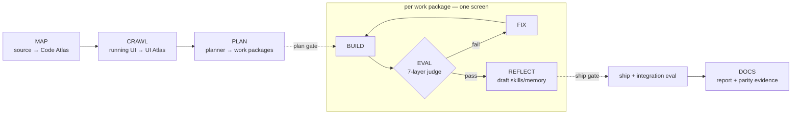
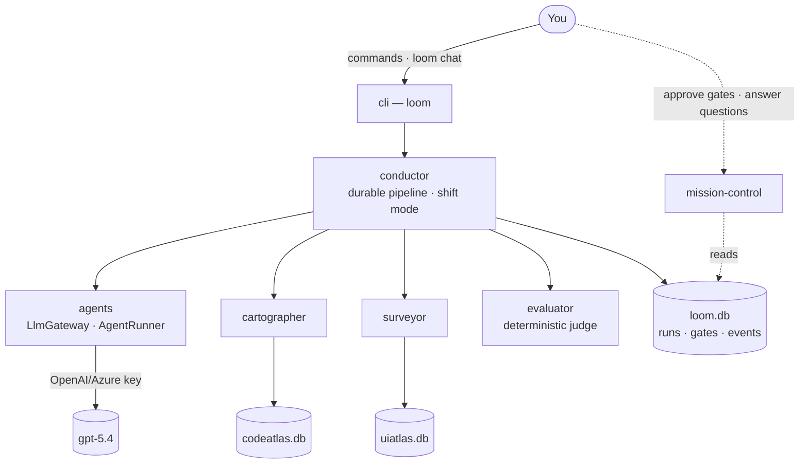

# Architecture

The Loom Harness maps an undocumented legacy application, crawls its running UI, rebuilds it screen-by-screen in a modern stack, and **proves** the rebuild matches the original — then does this autonomously, at scale, with a human in the loop.

This page is the map. Deeper "why" lives in [concepts/](concepts/) and [decisions/](decisions/).

## The pipeline

Every project moves through the same stages. A _work package_ (WP) is usually one screen.

- **MAP** (cartographer) builds a queryable model of the _source_.
- **CRAWL** (surveyor) builds a model of the _running UI_ — captured from the most reliable deployment (production, when the local replica is unreliable).
- **PLAN** (planner agent) emits work packages; a human approves the plan.
- **BUILD → EVAL → FIX** is the inner loop: an agent builds a screen, the deterministic judge scores it, a fixer addresses failures, repeat until the gates pass or a guard trips.
- **REFLECT** distils reusable lessons into skills/memory so later screens go faster.
- A human **ship gate** and an **integration eval** (cumulative, cross-screen) guard the result; **DOCS** produces the modernization report and per-screen parity evidence.

## Subsystems (monorepo packages)

| Package           | Responsibility                                                                                                                   | Status |
| ----------------- | -------------------------------------------------------------------------------------------------------------------------------- | ------ |
| `core`            | Domain types; SQLite with a `node:sqlite` fallback; migrations; append-only event log; profile/config loader                     | ✅     |
| `agents`          | The `LlmGateway` (Model B — direct calls), drivers, the guarded `AgentRunner`, model profiles, the model-adaptive context packer | ✅     |
| `evaluator`       | The deterministic, LLM-free judge: visual diff, DOM/style/coverage layers, scorecard; + a consensus panel for subjective calls   | ✅     |
| `browser`         | Thin Playwright wrapper (screenshot + DOM capture) — kept separate so the evaluator stays pure                                   | ✅     |
| `cli`             | The `loom` command — a thin presentation layer with a strict `--json` contract and documented exit codes                         | ✅     |
| `test-kit`        | A scriptable mock LLM server and test helpers                                                                                    | ✅     |
| `cartographer`    | Source scanners → Code Atlas + MCP queries + recovered docs (and panel verification)                                             | ✅     |
| `surveyor`        | Playwright crawler/recorder → UI Atlas                                                                                           | ✅     |
| `conductor`       | The durable outer loop: WP queue, worker pool, guards, gates, crash-resume, shift mode, spans                                    | ✅     |
| `mission-control` | Local web UI for supervision (read-only over `loom.db`; gate/question decisions write back)                                      | ✅     |
| `skills`          | Skill runtime + library; progressive disclosure + DIGIT export/import                                                            | ✅     |

The same picture as a graph — how the pieces and the three stores connect:

## Key design choices (and where they're explained)

- **Model B — the harness owns the loop.** It calls the LLM endpoint directly and runs _its own_ agent loop, so it controls the tools, guards, protected paths, and the full audit trail. Nothing is delegated to an external agent. → [ADR 0001](decisions/0001-model-b-direct-llm.md)
- **The judge is deterministic and LLM-free.** The thing that decides "is this rebuild correct?" cannot be argued with by the builder; it's pure code, mutation-tested in both directions. → [ADR 0003](decisions/0003-deterministic-evaluator.md) · [concept](concepts/the-evaluator.md)
- **One durable store, no servers.** SQLite (WAL) is the system of record; an append-only event log is the observability spine. No Docker, no database server. → [ADR 0002](decisions/0002-sqlite-node-sqlite-fallback.md)
- **Self-contained.** No runtime dependency on external agent frameworks or company tooling; everything app-specific lives in a swappable profile. → [ADR 0004](decisions/0004-self-contained.md)
- **Production is the source of truth** for the parity baseline when the local replica can't be trusted. → [ADR 0005](decisions/0005-production-as-baseline.md)

## Data flow & stores

Three SQLite files live in the project's data directory (always outside any git clone):

- **`loom.db`** — the task graph (runs, work packages, attempts, gates, budgets), the append-only `events` + `spans` (observability), artifacts index, skills/memory index.
- **`codeatlas.db`** — the source model: symbol nodes, the `screen→action→jsp→service` edge graph, generated docs, full-text + (optional) vector search.
- **`uiatlas.db`** — the running-UI model: states, per-viewport captures (screenshot/DOM/styles/HAR), navigation edges, form schemas, replayable flows.

The **conductor** is the single writer of `loom.db`; agents run as child processes and communicate over the event log, which keeps the system observable and crash-resumable. **Mission Control** reads the same store read-only, so the live view and post-hoc forensics are identical.

## How the pieces talk

- Agents reach the atlases through **MCP servers** (`codeatlas`, `uiatlas`, `parity`), so an agent can pull exactly the context it needs on demand rather than being handed everything.
- The **context packer** assembles a per-work-package "work order" sized to whatever model is active (128K–1M windows), so the same harness runs unchanged across model tiers.
- Everything an agent or tool does becomes an **event/span**, giving one correlation chain `run → work_package → attempt → step` that powers status, the live dashboard, cost accounting, and time-travel debugging.
