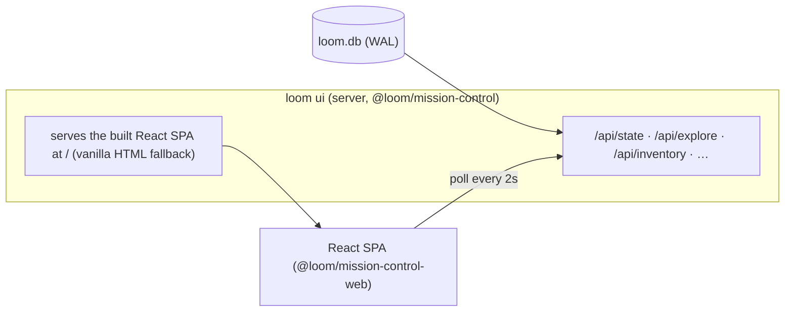

# The Cockpit — React Mission Control

> A living tracker for the React Mission Control (R9 Thrust B). The goal: **see what the harness is
> doing at every moment** — the rebuild pipeline and the live `loom explore` crawl — and drive it
> from the browser, never staring at a blind spinner.

## What it is

`loom ui` starts a localhost server (`@loom/mission-control`) over the single `loom.db`. It serves a
real **React single-page app** (`@loom/mission-control-web` — Vite + React + TypeScript + TanStack
Query + Tailwind, themed with the `@loom/tokens` brass palette) that polls the harness's
framework-agnostic JSON endpoints every ~2s.



**Single writer preserved.** The server reads everything and writes back **only** human
gate/question decisions — the same documented exception as the vanilla dashboard. The React app
consumes the _exact same endpoints_, so nothing about the safety model changes.

**Pod-safe fallback.** The server serves the React bundle when `mission-control-web/dist` is present
(it is, after `pnpm build`); if the bundle is ever missing it falls back to the original vanilla
HTML dashboard — so `loom ui` always works, built or not.

## How it's built

`pnpm build` runs `tsc -b` (the TypeScript packages) and then `vite build` for the web app
(`packages/mission-control-web/dist`, pure JS — no extra pod tooling). The SPA's tests run under Vitest + Testing Library
(jsdom) as their own project; the server's SPA-serving + path-confinement is covered by
`server.test.ts`.

## Status

| Phase   | What                                                                                                                                | Ships      |
| ------- | ----------------------------------------------------------------------------------------------------------------------------------- | ---------- |
| **B.1** | Scaffold + toolchain; server serves the SPA (vanilla fallback); **run header + kanban board**; live status pill                     | v1.3.24 ✅ |
| **B.2** | **Live fleet** (screen · phase · elapsed · tokens) · **inbox** (approve/reject + answer) · **cost** + **eval** analytics (Recharts) | v1.3.25 ✅ |
| **B.3** | **Live Crawl** tab: current URL · move feed · thumbnail grid · stats strip · live token-burn line                                   | v1.3.26 ✅ |
| B.4/5   | Orchestrator/sub-agent fleet · WP drill-down · inventory · project switcher · scoped launch actions; retire vanilla; cut v1.4.0     | next       |

## Run it

```bash
loom ui --open      # builds are served from mission-control-web/dist; vanilla if unbuilt
```
