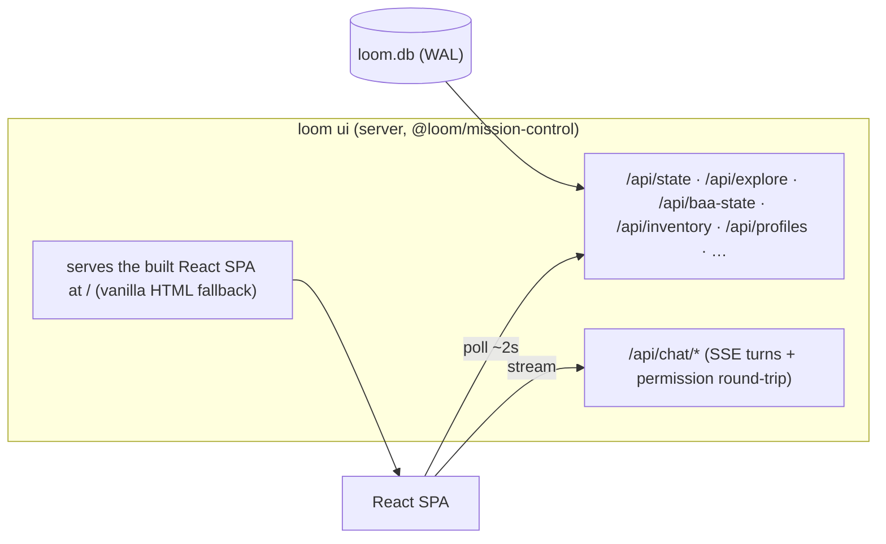

# The Cockpit — React Mission Control

> **See what the harness is doing at every moment, and drive it from the browser** — the rebuild
> pipeline, the live crawl, the agent orchestration, and a general agent chat — never staring at a
> blind spinner, always with a human in the loop and a kill switch in reach.

## What it is

`loom ui` starts a localhost server (`@loom/mission-control`) over the single `loom.db`. It serves a
real **React single-page app** (`@loom/mission-control-web` — Vite + React 19 + TypeScript + TanStack
Query + Tailwind v4 + Recharts) that polls the harness's framework-agnostic JSON endpoints (~1.5–2s)
and streams chat turns over SSE.



## Surfaces

The shell is a small **surface registry** (`App.tsx`) — adding a surface is one entry, not a rewrite;
the base (server, durable store, tools, permission gate, theme) is shared. Tabs:

| Surface | What it shows |
|---|---|
| **Dashboard** | Run header · kanban board (per pipeline state) · live fleet · inbox (gate/question approve+answer) · cost + eval analytics (Recharts) · capabilities inventory. |
| **Live Crawl** | The live `loom explore` crawl: current URL · move feed · discovered-screen thumbnails · stats strip · client-side token-burn line. |
| **Agents** | **Live orchestration** — the orchestrator node (pulses while summoning), live **subagent** cards (screen · phase · attempt · tokens · last action), and a colour-coded activity feed. A **Halt** button stops everything. |
| **Chat** | **Surface A — the general agent.** A browser chat over the *same* extracted agent loop the CLI uses (`@loom/chat`): streaming replies, inline tool-call cards, an in-UI **permission prompt** (Yes/No/Always/Allow-all), a **Stop** button, durable conversations, and a pill status bar (model · profile · tokens · context). |
| **BAA** | **Surface B — the modernization pipeline** as a stage graph: `MAP → PLAN → CRAWL → BUILD → SHIP`, each startable; EVAL↔FIX runs inside BUILD; SHIP is a human gate in the inline Inbox. A **Halt** button stops the run. |
| **Setup** | A guided **onboarding wizard** (Welcome → Prerequisites → Legacy app → Model → Review) that generates a ready-to-paste `loom.config.yaml` + the pod commands. |
| **Settings** | A Hermes-style **Control Center**: switch **Profiles** (the learning root — memory + skills — no restart), browse **Skills** (searchable), set **Preferences** (theme, send-key), and **About**. The active profile is also a one-click chip in the top bar. |

## Theme

Two themes off one CSS-variable token set, flipped by `data-theme` on `<html>` (remembered in
`localStorage`, default **light**): a clean **light** enterprise surface and a premium **dark**
command-center, both with a single **"signal" accent** colour. Components reference only the semantic
tokens, so the accent is a one-line swap and dark/light is one attribute flip.

## Control & safety model

The server reads everything; its **writes** are deliberately bounded and each maps to an explicit,
human-initiated action:

- **Gate / question decisions** — approve/reject a gate, answer a question (the original exception).
- **Chat turns** — persisted to `chat_sessions`/`chat_messages` (orthogonal to the run task-graph;
  the conductor never touches them). Expensive tools prompt for permission in the UI.
- **Profile switch** — swaps the in-memory profile learning-root for new chat turns (no restart).
- **Stage spawn** (`POST /api/baa/stage`) — launches a **detached `loom <stage>` child**, so the
  **conductor stays the single writer** of the run task-graph and the work survives a UI restart. The
  server never drives `runPipeline` inline.
- **Halt** (`POST /api/baa/stop`) — the **kill switch**: SIGTERMs the spawned stage processes, marks
  the run `stopped`, and blocks its in-flight work packages (resumable — a new BUILD picks them up).
  A streaming **chat turn** has its own Stop (aborts the request; the server settles cleanly).

So there is always a human in the loop (permission prompts, gates, the inbox) and always a way to
stop (Halt on Agents/BAA, Stop in Chat).

## Endpoints (added for the surfaces above)

`POST/GET /api/chat/sessions` · `GET /api/chat/sessions/:id` · `POST /api/chat/sessions/:id/turn`
(SSE) · `POST /api/chat/turns/:id/permission` · `GET /api/chat/info` · `GET /api/profiles` ·
`POST /api/profiles/active` · `GET /api/baa-state` · `POST /api/baa/stage` · `POST /api/baa/stop`.
The pre-existing `/api/state · /api/explore · /api/inventory · /api/wp/:id · /api/projects · /api/gates/:id · /api/questions/:id` are unchanged.

## How it's built

`pnpm build` runs `tsc -b` (the TypeScript packages) then `vite build` for the web app
(`packages/mission-control-web/dist`, pure JS — no extra pod tooling). The SPA's components are tested
under Vitest + Testing Library (jsdom); the server's endpoints (chat, profiles, BAA stage/stop) under
the `@loom/mission-control` suite. If the bundle is ever absent, `loom ui` falls back to the original
vanilla HTML dashboard — so it always works, built or not.

## Run it

```bash
loom ui --open      # served from mission-control-web/dist; vanilla fallback if unbuilt
```

Chat + profiles + the BAA stage triggers light up when `loom ui` is started from a **configured
project** (a `loom.config.yaml` with a model); the read-only dashboard works without one.
```
