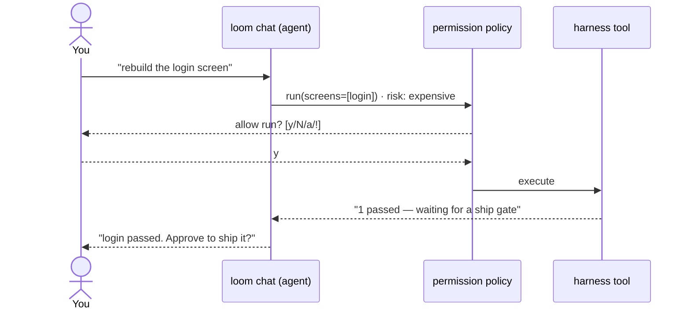
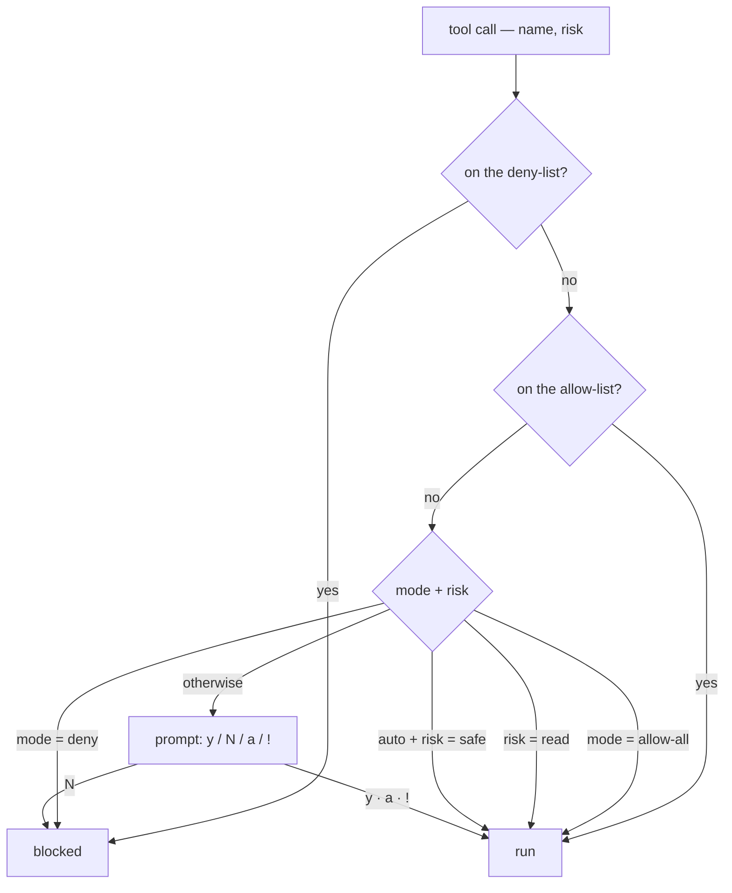

# The agentic chat & permissions

`loom chat` is a Claude-Code/Hermes-style **agentic REPL**: you talk in plain language, and the model drives the harness by calling tools — checking status, mapping the source, running the rebuild, and working the gate/question inbox — pausing for your approval before anything expensive.

It's built on the harness's existing tool-calling loop (`AgentRunner`): no new agent, just a harness-driving toolset plus a permission gate.

## The loop

After a run, the agent reads the inbox and surfaces what needs you — screens waiting for a ship gate, and blocked-screen questions — then helps you resolve them (`approve_gate`, `answer_question`) and `resume`. The inbox already exists; the chat is just the conversational bridge over it.

## The toolset

| Tool                                     | Risk        | What it does                                    |
| ---------------------------------------- | ----------- | ----------------------------------------------- |
| `status`, `list_gates`, `list_questions` | `read`      | Read run state + the open inbox (never prompts) |
| `approve_gate`, `reject_gate`            | `expensive` | Decide a gate (e.g. ship a passed screen)       |
| `answer_question`                        | `expensive` | Answer a blocked screen's question              |
| `map`                                    | `expensive` | Build the CodeAtlas from the legacy source      |
| `run`, `resume`                          | `expensive` | Run / resume the rebuild pipeline               |

Pipeline tools resolve their config lazily, so on a half-configured profile the agent gets a friendly "you still need `source.strutsConfig` + `app.baseUrl`" instead of a crash.

## Permissions

Every tool call passes through a session **permission policy** before it runs. The model can never silently spend tokens or change state — and the deterministic evaluator still judges every rebuild, so even `allow-all` can't ship unverified work.

**Modes** (set with `--permission-mode`, or `/ask` `/auto` `/allow-all` `/deny` in the REPL):

- **`ask`** (default) — prompt before every mutating/expensive tool; reads run free.
- **`auto`** — also auto-allow `safe` tools; prompt only for `expensive` ones.
- **`allow-all`** (a.k.a. `--allow-all` / `--yolo`) — never prompt; fully autonomous.
- **`deny`** — block every tool (a dry run of the conversation).

**At a prompt** you answer **`y`** (once), **`N`** (decline), **`a`** (always allow _this tool_ this session), or **`!`** (flip to allow-all). The `a`/`!` answers update the policy for the rest of the session.

**Slash commands:** `/help` · `/allow-all` · `/ask` · `/auto` · `/deny` · `/allow <tool>` · `/exit`.

> The mode spectrum, the safe-tool safelist, and the `y/N/a/!` prompt are adapted from **OpenAI Codex CLI** and **Cline** (both Apache-2.0) — see [adopted-patterns](../research/adopted-patterns.md). The policy is enforced at the L1 HookBus `PreToolUse` seam.

## Driver requirement

The agentic chat needs **tool-calling**, which the OpenAI and Anthropic drivers surface but the (now-disabled) Copilot CLI does not — another reason Loom is [OpenAI/Azure-only](interaction-model.md#where-the-model-fits).

## See also

- [How you interact with Loom](interaction-model.md) — the big picture (commands · inbox · chat).
- [The conductor](the-conductor.md) — what a `run` actually does.
- [The evaluator](the-evaluator.md) — why "allow-all" still can't fake a pass.
