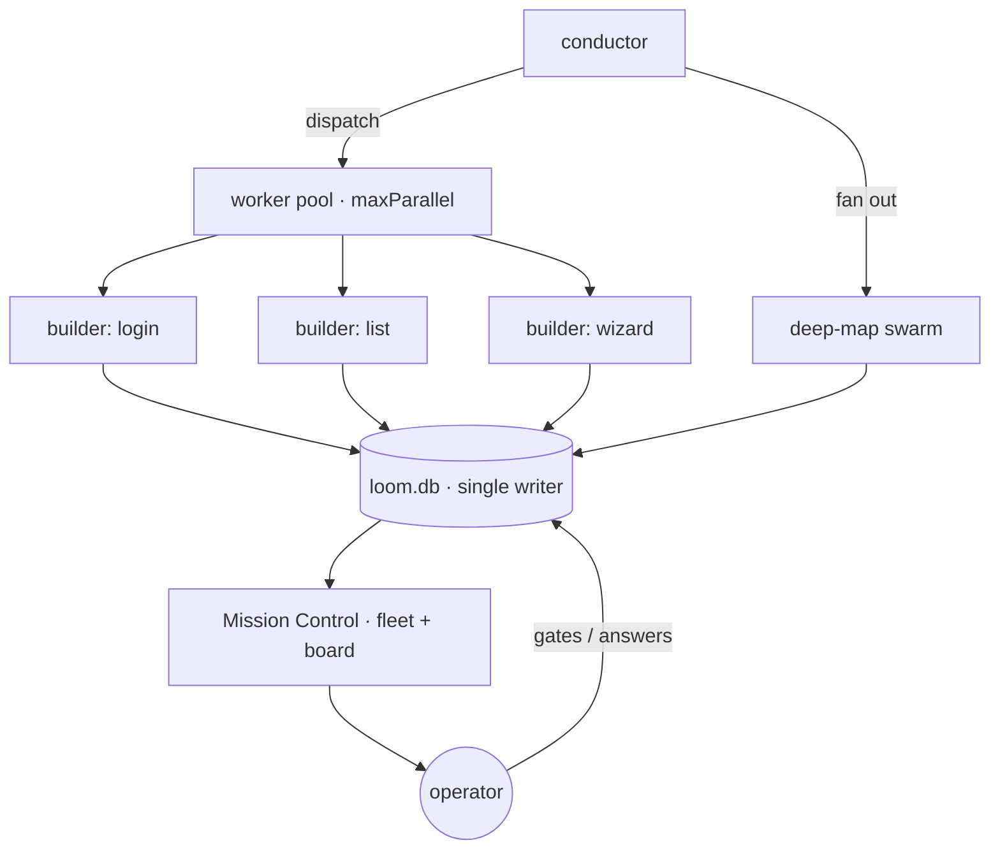
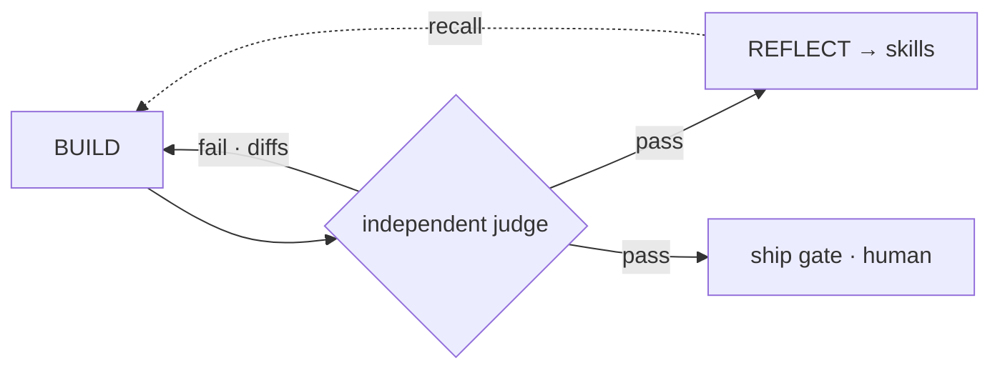

# Loom as a closed-loop fleet

Loom is an instance of the **closed-loop fleet** architecture — a bounded fleet of agents working in parallel, wrapped in feedback loops that steer each next action from observed outcomes. It has one deliberate twist the textbook version doesn't: the loop is closed by an **independent judge**, not by the agents grading themselves.

## What "closed-loop fleet" means

Two halves:

- **Fleet** — many agents run concurrently under an orchestration layer that decides which run, how they share state, how a human reviews them, and **how the operator sees what's happening**.
- **Closed loop** — every cycle ends in feedback: observe the outcome, learn, adjust the next action (plan → act → observe → adapt), with durable checkpointing so a crash resumes mid-loop.

## The fleet

- **Worker pool** (`conductor/src/workers/pool.ts`, `pipeline.ts:buildWorker`) — up to `maxParallel` screens build concurrently, pulled off a dependency-ordered queue.
- **Deep-map swarm** (`conductor/src/deep-map.ts`) — same-instruction sub-agents fan out to map a large app.
- **Orchestration** — the conductor schedules, bounds the run (shift limits, stop-the-line), and serializes all shared state through the single-writer `loom.db`.
- **The operator sees the fleet** — Mission Control's live **fleet view** (each running worker: screen · phase · elapsed · tokens) + the **kanban board** (screens grouped Queued / In progress / Needs you / Done / Failed). See [observability](observability.md).

## The loops

Loom closes the loop at three scales:

1. **Per screen — BUILD → EVAL → FIX.** A build is judged; the exact differences feed back into the next attempt. Closed until parity or a budget trips.
2. **Per run — integration eval + stop-the-line.** Passed screens are re-checked cumulatively (regression feedback); a consecutive-failure signal halts the fleet rather than thrashing.
3. **Across runs — self-improvement.** Passed screens distil into skills (the Reflector); recall feeds the right skills into future screens; proven skills auto-promote. Worklog memory carries failed attempts forward so the Fixer never repeats a dead end. This is the perpetual loop — screen #50 is cheaper than screen #5.

## The deliberate twist: an independent judge, not self-evaluation

The canonical closed-loop agent is described as "both the performer **and** the evaluator of its own actions." **Loom refuses that.** The feedback comes from a **deterministic, LLM-free judge** that runs in a clean checkout the building agent cannot touch ([the evaluator](the-evaluator.md) · [ADR 0003](../decisions/0003-deterministic-evaluator.md)). The loop is still closed — the verdict and the diffs steer the next build — but the evaluator is a **separate component**, never the agent grading itself.

Why it matters: a fleet that grades its own work will, under enough optimization pressure, learn to fool its own grader — reward-hacking. An independent judge can't be talked into a pass. This is the single biggest reason to trust an autonomous Loom run, and the main place Loom departs from the generic pattern.

## Durable, human-in-the-loop, and bounded

- **Durable** — every transition is checkpointed to SQLite; `reconcileInterrupted` + idempotent stages + `loom resume` recover a crashed run exactly where it stopped.
- **Human-in-the-loop** — gates + the questions inbox are never auto-approved; a blocked screen escalates a question and (when a webhook is set) pings you on Teams/Slack. See [the agentic chat](agentic-chat.md).
- **Memory is first-class** — project facts, per-screen worklog, and run reflections feed recall ([skills & memory](skills-and-memory.md)).
- **MCP tool layer** — tools are connected through `@loom/mcp` (client + server), gated by the L1 permission system.

**The boundary:** Loom is a _bounded task-fleet_. It closes the loop over a finite scope (an app's screens) until coverage is 100% or a budget trips — not an always-on, event-driven operational fleet reacting to a live stream. The self-improvement loop is perpetual across runs; a single run terminates with a coverage ledger and a report.

## See also

- [The conductor](the-conductor.md) — the durable pipeline that runs the fleet
- [The evaluator](the-evaluator.md) — the independent judge that closes the loop
- [Skills & memory](skills-and-memory.md) — the self-improvement loop
- [Observability](observability.md) — the fleet view + kanban board
- [Internals deep-dive](../internals.md) — the whole system, end to end
