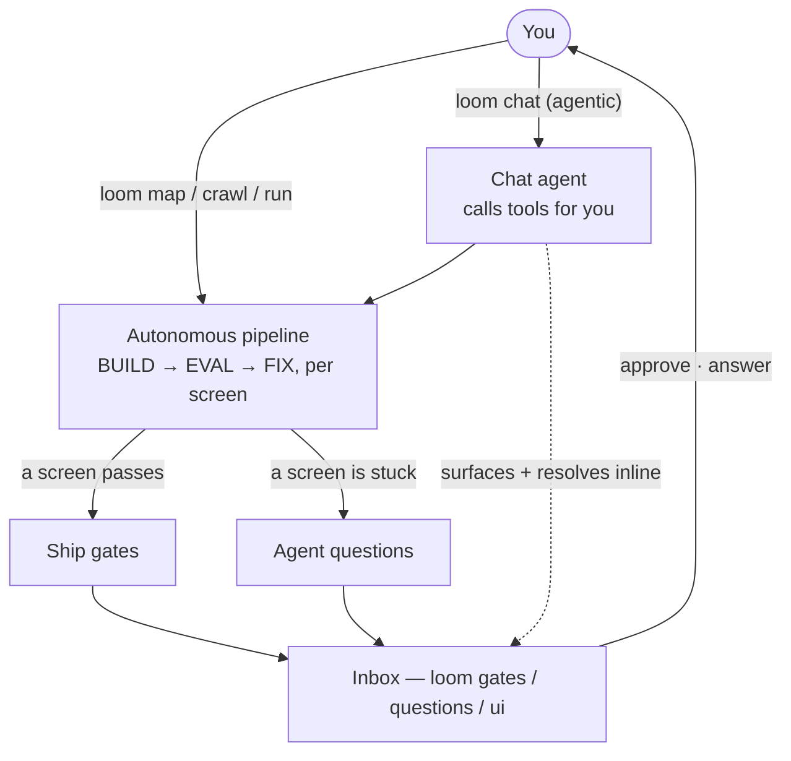

# How you interact with Loom

Loom is a **command-driven, autonomous pipeline with a human in the loop** — and, on top of that, an **agentic chat** you can talk to. You don't converse with it to do the work the way you would a code assistant; you point it at a legacy app, it runs for minutes to hours, and you supervise. Knowing this up front saves the "wait, how do I talk to it?" moment.



## The three ways you interact

**1. Pipeline commands — you drive the stages.**

```
loom map → loom crawl → loom run [--shift] → loom resume / loom stop
```

`map` scans the legacy source into the CodeAtlas (and writes the docs it never had); `crawl` captures the running app as the trusted baseline; `run` rebuilds each screen, judges it across the [seven evaluator layers](the-evaluator.md), and fixes failures. `--shift` runs it unattended under [safeguards](the-conductor.md). `loom next` always tells you which command comes next from your current state.

**2. Human-in-the-loop decisions — the harness asks, you answer.**

A shift doesn't stop to chat; it queues decisions and keeps working on un-gated work. You clear them when convenient:

- `loom gates list | approve | reject` — plan, deviation, ship, and new-skill gates.
- `loom questions list | answer` — a blocked screen escalates here with its worklog.
- `loom watch` (terminal) or `loom ui` (Mission Control web app) — see live progress, budgets, and the inbox; the web app writes gate/question decisions back.

This _is_ the conversation in autonomous mode — structured approvals and answers, not free text.

**3. The agentic chat — talk to it and it acts.**

```bash
loom chat                 # an agentic REPL: it maps/runs and works the inbox for you
loom ask "…"              # a one-off question to the model (no tools)
```

`loom chat` is a Claude-Code-style driver: you say what you want, it calls the right harness tools (`status`, `map`, `run`, `approve_gate`, `answer_question`, …), and after a run it surfaces the screens awaiting approval and the blocked-screen questions and helps you resolve them inline. Every expensive or state-changing action is gated by a [permission policy](agentic-chat.md) (`ask → auto → allow-all`), so the model can't silently spend tokens or change state. `loom ask` is the simpler escape hatch — a direct question with no tools.

## Where the model fits

Every "thinking" step — writing docs, writing the rebuild, deciding what to click, and now driving the chat — calls a model through one **gateway driver**:

- **`openai`** — a direct OpenAI/Azure endpoint (`LLM_BASE_URL` + `LLM_API_KEY`). The default and only active path; it authenticates Azure's `…/openai/v1` surface out of the box.
- **`anthropic`** — for portability outside the bank.

> The `copilot` driver code still ships but is **disabled** — Loom is OpenAI/Azure-only (the agentic chat needs tool-calling, which the Copilot CLI doesn't surface). `loom models list` shows the active provider; `loom models test` probes it live.

The drivers are swappable: nothing else in the harness — the scanners, crawler, evaluator, conductor, skills, Mission Control — knows or cares which model answered.

## Deterministic pipeline, conversational control

There's a useful tension here. The **pipeline** is deterministic and resumable so an 8-hour unattended shift is safe, auditable, and repeatable — properties a chat loop can't give you. The **chat** is the conversational way to _drive_ that pipeline and clear its inbox. Either way, the deterministic evaluator — not the model, and not you — decides whether a rebuild passes, so "allow-all" can never ship unverified work.

## See also

- [The agentic chat & permissions](agentic-chat.md) — the chat loop, the toolset, and the permission modes.
- [The CLI](../guides/cli.md) — every command, the `--json` contract, exit codes.
- [The conductor](the-conductor.md) — shift mode, the work-package state machine, safeguards.
- [LLM gateway & drivers](llm-gateway-and-drivers.md) — the driver abstraction.
