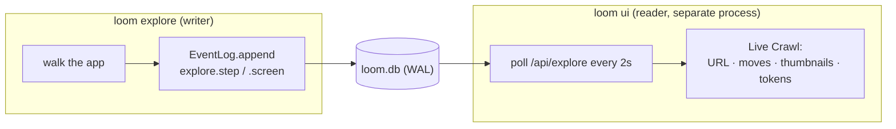

# Observability — always know what the harness is doing

One spine, many views. Every action the harness takes is recorded over the single `loom.db`, so "what happened at 3am" is a query, not a mystery — and the same data drives the terminal and the browser.

## The data model

- **Events** (`EventLog`, append-only) — the human-readable timeline: `map.completed`, `wp.passed`, `eval.scored`, `shift.stopped`, `skill.promoted`, `memory.consolidated`, `heartbeat`, the `explore.*` crawl stream (`started`/`step`/`screen`/`diagnostic`/`completed`), and the rest. Each event is correlated to its `run → work package → attempt`.
- **Spans** (`SpanStore`) — the **OpenTelemetry GenAI-shaped** layer for cost and timing: every LLM/tool/eval operation is a span (kind `llm|tool|eval|stage|attempt`, status, start/end, duration, free-form `gen_ai.*` attributes) under a trace (the run). `aggregate(runId)` rolls spans up into token + duration totals — the cost view. The conductor records a GenAI span per build attempt.

Both are read-only for any viewer; the conductor is the single writer (the one exception is human gate/question decisions — see below).

## The views

- **`loom watch`** — a single-glance terminal dashboard (SSH/pod-native): the active run + stage, a screen tally by state, token spend, the gates/questions waiting, the recent event feed, and a heartbeat-staleness **"is it wedged?"** flag. The frame renderer (`renderWatchFrame`) is a pure function, so it's snapshot-testable.
- **Mission Control** (`loom ui`) — the local web dashboard (`@loom/mission-control`), `@loom/tokens`-themed, no build step (pod-friendly). It polls `/api/state` (the `dashboardState` read model: run, pipeline tally, cost, the inbox, recent events) and is **drivable gate-to-gate from the browser** — approving a ship gate or answering a blocked screen's question writes back via `POST /api/gates/:id` / `/api/questions/:id`. Those decisions are the **only** writes Mission Control performs — the single documented exception to the conductor's single-writer rule. Localhost-bound, read-only otherwise.
- **Live Crawl** — Mission Control's view of a running `loom explore`. `loom explore` is a separate process, but it now records every move to `loom.db`, so the dashboard reads it live (WAL makes the cross-process writer + reader safe): the current page, every click/fill as it happens, a thumbnail grid of discovered screens (`/api/explore-shot/<key>.png`), and the **running token / elapsed / tokens-per-sec** — so a long crawl is never a blind spinner. Served by `exploreState()` + `GET /api/explore`.

- **`loom logs`** — tail the raw event log (`--run`/`--wp` filters).

## Export

When `OTEL_EXPORTER_OTLP_ENDPOINT` is set, a run's spans are exported at finish to `<endpoint>/v1/traces` as OTLP/HTTP (`toOtlpTraces`/`exportSpansOtlp`, GenAI semantic conventions) — so any collector the bank already runs can ingest them. Best-effort and isolated: a down collector never affects the run.

When `LOOM_WEBHOOK_URL` is set, the conductor POSTs a Teams/Slack-compatible **webhook** ping (`notifyWebhook`) on **stop-the-line** and **shift-done** — so an unattended shift can reach a human asynchronously. Also best-effort and isolated.

## Why it holds up

Append-only events + OTel spans + content-addressed artifacts mean any past attempt is fully reconstructable. Mission Control runs read-only against the DB, so it can be opened mid-shift or long after with identical fidelity.
