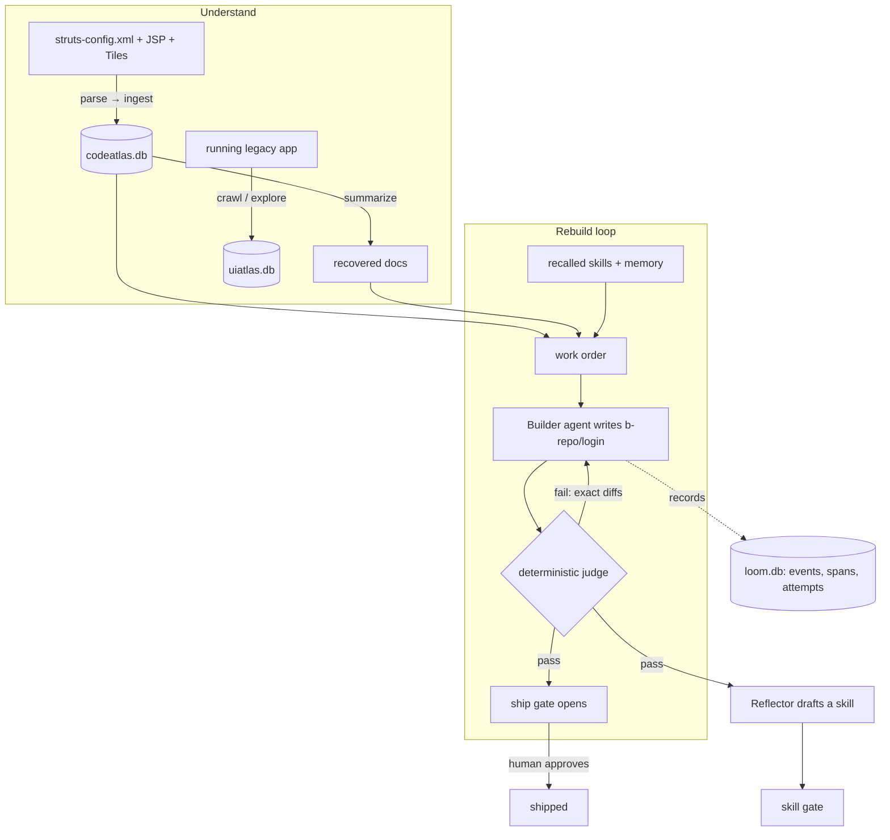
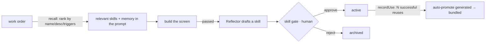

# Loom Harness — internals deep-dive

> **Audience:** you, the creator/maintainer. This is the one document that explains the **whole system end to end** — the mental model anyone can repeat, then the exact mechanics with file paths so you can answer detailed questions and change the code with confidence. The shorter concept pages under [`concepts/`](concepts/) cover the _why_ of each idea; this page is the _how it all fits together_.

**Contents**

1. [The 60-second mental model](#1-the-60-second-mental-model)
2. [The one screen, end to end](#2-the-one-screen-end-to-end)
3. [The package map](#3-the-package-map-14-loom-packages)
4. [The data model — three SQLite stores](#4-the-data-model--three-sqlite-stores)
5. [The pipeline (the conductor)](#5-the-pipeline-the-conductor)
6. [The agent layer](#6-the-agent-layer)
7. [Tools, hooks, and permissions](#7-tools-hooks-and-permissions)
8. [The evaluator (the judge)](#8-the-evaluator-the-judge)
9. [Skills & memory — the self-improvement loop](#9-skills--memory--the-self-improvement-loop)
10. [The CLI](#10-the-cli)
11. [The agentic chat](#11-the-agentic-chat)
12. [Observability & Mission Control](#12-observability--mission-control)
13. [Config, profiles & workspace isolation](#13-config-profiles--workspace-isolation)
14. [Safety model — everything that stops a runaway](#14-safety-model--everything-that-stops-a-runaway)
15. [Known limitations & what's not built](#15-known-limitations--whats-not-built)
16. [FAQ — questions you'll be asked](#16-faq--questions-youll-be-asked)
17. [Glossary](#17-glossary)

---

## 1. The 60-second mental model

**The pitch in one sentence:** Loom takes a legacy web app with no documentation, figures out what every screen is, rebuilds each screen in modern code, and _proves_ each rebuild is pixel- and behaviour-identical to the original — automatically, at scale, with a human approving the important steps.

**The three moves it makes, in order:**

1. **Understand** the app two ways — read the **source** (Struts/JSP/Tiles → a graph called the **CodeAtlas**) and watch the **running UI** (a Playwright crawler → a **UI atlas** of screenshots + DOM). Where the source had no docs, an LLM writes them from the evidence.
2. **Rebuild** one screen at a time: an LLM agent writes the new code into a sandboxed folder (`b-repo`), then a **deterministic, LLM-free judge** scores it against the original across several layers. If it fails, the agent gets the exact differences and tries again. This is the **BUILD → EVAL → FIX** loop.
3. **Compound & supervise**: every passed screen distils into a reusable **skill** so screen #50 is faster than screen #5; a human approves **gates** (ship this screen? activate this skill?) and answers **questions** when the agent is stuck. It can run unattended for hours in **shift mode** with hard budget/safety limits.

**The two things that make it trustworthy:**

- **The judge is pure code, not an LLM.** The model that builds the screen can't argue with, bribe, or reward-hack the thing that grades it ([ADR 0003](decisions/0003-deterministic-evaluator.md)).
- **The harness owns its own agent loop** ("Model B" — [ADR 0001](decisions/0001-model-b-direct-llm.md)). We control which tools exist, where files can be written, the budgets, and the audit trail — none of it is delegated to a black-box agent.

**Where the LLM fits:** the model is _one swappable component_ behind the `LlmGateway` seam. It builds screens, fixes them, writes recovered docs, and drives the chat — but it never decides whether a rebuild passed. Loom is currently **OpenAI/Azure-only** (the only active driver path; see [§6](#6-the-agent-layer)).

**The shape of it:** parallel agents (a fleet) steered by feedback loops, with the loop closed by an _independent_ judge rather than self-evaluation — Loom is a [closed-loop fleet](concepts/closed-loop-fleet.md).

---

## 2. The one screen, end to end

Follow a single screen (say `login`) through the whole system. Every arrow is a real function call you can find.



1. **MAP** — `mapOnce` (in `packages/conductor/src/pipeline.ts`) parses `struts-config.xml`, the Tiles defs, `web.xml`, and the JSPs (`@loom/cartographer`) and ingests them into **`codeatlas.db`**. `loom atlas summarize` then writes one grounded doc per screen — the documentation the app never had.
2. **PLAN** — the conductor creates one **work package** (WP) for `login` in `loom.db` and sets it `planned`.
3. **CRAWL** — the conductor captures the legacy "A" baseline screenshot of `login` from the running app (full crawl/exploration of menu-driven apps lives in `@loom/surveyor` → **`uiatlas.db`**).
4. **BUILD** — `buildWorkOrder` assembles a work order (the action class, the real JSP source, parsed forms, the repo-map, **plus recalled skills and memory**), and the **Builder** runs the `AgentRunner` loop, writing files only inside `b-repo/login` via a protected `write_file` tool.
5. **EVAL** — `evaluateScreen` serves `b-repo/login` and scores it against the baseline across the deterministic gates (visual + structural DOM + computed-style + functional). One AND verdict.
6. **FIX** — on failure, the differences become "Prior attempt feedback" appended to the work order, and the loop retries (up to `maxAttempts`, default 3).
7. **REFLECT → ship** — on pass: a **ship gate** opens (a human marks it shipped), the **Reflector** drafts a reusable skill (which opens a **skill gate**), and the screen is credited to every skill it used. Every step writes an **event** and a **span** to `loom.db`.

If it never passes, the WP goes `blocked` and a **question** is filed in the inbox with the worklog of everything tried.

---

## 3. The package map (14 `@loom/*` packages)

A pnpm monorepo of strict-TypeScript, ESM packages. Dependencies flow one way: `core` depends on nothing; `cli` depends on everything.

| Package                 | Path                       | Responsibility                                                                                                  | Key entry points                                                                                                 |
| ----------------------- | -------------------------- | --------------------------------------------------------------------------------------------------------------- | ---------------------------------------------------------------------------------------------------------------- |
| `@loom/core`            | `packages/core`            | SQLite adapter + migrations; the stores; event log; spans; config + workspace loaders; webhook notifier         | `db/`, `tasks/tasks.ts`, `events/`, `memory/`, `skills/`, `gates/`, `questions/`, `spans/`, `config/`            |
| `@loom/agents`          | `packages/agents`          | `LlmGateway` + drivers; `AgentRunner` + guards; `ContextPacker`; recall; the LLM roles (Reflector, judge panel) | `types.ts`, `drivers/`, `agent-runner.ts`, `context/`, `roles/`                                                  |
| `@loom/tools`           | `packages/tools`           | Typed tool registry; the hook bus; the permission policy; protected-paths hook; tool namespacing                | `tools.ts`, `hooks.ts`, `permissions.ts`, `protected-paths.ts`                                                   |
| `@loom/cartographer`    | `packages/cartographer`    | Struts/JSP/Tiles/web.xml scanners → CodeAtlas; repo-map; doc-recovery pass; codeatlas MCP server                | `map.ts`, `*-parser.ts`, `codeatlas.ts`, `repo-map.ts`, `summarize.ts`, `verify-docs.ts`, `discover.ts`          |
| `@loom/surveyor`        | `packages/surveyor`        | Playwright BFS crawler + AI-explorer → UI atlas; state identity; form/link extraction                           | `crawl.ts`, `crawl-app.ts`, `explore.ts`, `state-identity.ts`, `forms.ts`, `ui-atlas.ts`                         |
| `@loom/browser`         | `packages/browser`         | Playwright control: screenshots, normalized DOM capture, viewport mgmt, crawl session                           | `capture.ts` (`BrowserSession`, `CrawlSession`, `captureScreenshot`, `captureDom`)                               |
| `@loom/evaluator`       | `packages/evaluator`       | The deterministic, LLM-free parity judge; the coverage ledger; scorecard                                        | `diff.ts`, `dom-diff.ts`, `style-diff.ts`, `functional.ts`, `a11y.ts`, `anticheat.ts`, `coverage.ts`, `grade.ts` |
| `@loom/conductor`       | `packages/conductor`       | The durable pipeline; worker pool; shift safeguards; gates/questions wiring; integration eval                   | `pipeline.ts`, `builder.ts`, `eval-screen.ts`, `integration-eval.ts`, `work-order.ts`, `heartbeat.ts`            |
| `@loom/mission-control` | `packages/mission-control` | The local read-only web dashboard + gate/question write-back; project switcher                                  | `read-model.ts`, `inventory.ts`, `server.ts`, `ui.ts`                                                            |
| `@loom/mcp`             | `packages/mcp`             | Model Context Protocol — server (expose Loom atlases) + client (attach external tool servers)                   | `server.ts`, `client.ts`, `transport.ts`, `stdio.ts`, `adapter.ts`                                               |
| `@loom/skills`          | `packages/skills`          | SKILL.md parse/serialize; load a directory; relevance ranking; progressive disclosure; export                   | `skill-md.ts`, `load.ts`, `write.ts`, `rank.ts`, `disclosure.ts`, `transfer.ts`                                  |
| `@loom/tokens`          | `packages/tokens`          | The brand design tokens (palette, ASCII art) shared by the CLI and the WebUI                                    | `index.ts` (`LOOM`, `THREAD_SCALE`, `LOOM_SPLASH`, `tokensCss`)                                                  |
| `@loom/cli`             | `packages/cli`             | The `loom` operator surface — registry, context, errors, UI, every command, the chat                            | `bin.ts`, `program.ts`, `registry.ts`, `context.ts`, `errors.ts`, `commands/`, `ui/`                             |
| `@loom/test-kit`        | `packages/test-kit`        | Mock OpenAI-compatible LLM server; the legacy Struts fixture; Java detection                                    | `MockLlmServer`, `LegacyFixture`, `canRunJava`                                                                   |

**Reading order if you're new:** `core/src/db` → `core/src/tasks/tasks.ts` → `conductor/src/pipeline.ts` → `agents/src/agent-runner.ts` → `evaluator/src/grade.ts` → `cli/src/registry.ts`.

---

## 4. The data model — three SQLite stores

All state is SQLite, no server. There are **three** database files, each opened by its own adapter. Pragmas: WAL, `synchronous=NORMAL`, `busy_timeout=5000`, `foreign_keys=ON`. The conductor is the **single writer** of `loom.db`; atlases are written by MAP/CRAWL and read everywhere else.

### `loom.db` — the harness state (the spine)

Opened by `openDb` (`packages/core/src/db/`), migrated by `runMigrations(db, MIGRATIONS)`. Six **forward-only** migrations (`packages/core/src/db/migrations.ts`) — never edit a released one, always add a new version:

| #   | Name              | Tables                                                                              | Owner store              | What it holds                                                                                                                                           |
| --- | ----------------- | ----------------------------------------------------------------------------------- | ------------------------ | ------------------------------------------------------------------------------------------------------------------------------------------------------- |
| 1   | `events`          | `events`                                                                            | `EventLog`               | Append-only event stream (the audit log + the SSE/`watch` feed). Indexed by run and WP.                                                                 |
| 2   | `task_graph`      | `runs`, `work_packages`, `wp_deps`, `attempts`, `eval_scores`, `gates`, `artifacts` | `TaskStore`, `GateStore` | The heart: runs, the per-screen WPs + their state machine, each build attempt + token spend, eval scorecards, human gates, content-addressed artifacts. |
| 3   | `memory`          | `memory_index`                                                                      | `MemoryStore`            | Project facts, per-WP worklog, run reflections (`kind` column). Scoped per project.                                                                     |
| 4   | `skills`          | `skills_index`                                                                      | `SkillStore`             | The skill catalog: `tier` (bundled/project/generated), `status` (draft/active/archived), `use_count`/`success_count` for auto-promotion.                |
| 5   | `agent_questions` | `agent_questions`                                                                   | `QuestionStore`          | The agent→human inbox: a blocked screen's question + context (incl. worklog) + the answer.                                                              |
| 6   | `spans`           | `spans`                                                                             | `SpanStore`              | OpenTelemetry-GenAI-shaped spans (model, tokens, duration, status) for the cost/Live-Now views + optional OTLP export.                                  |

The most important table is **`work_packages.state`** — the screen state machine (see [§5](#5-the-pipeline-the-conductor)). **`attempts`** records every build try with `input_tokens`/`output_tokens`/`cost`/`role`/`failure_reason` — that's where all the spend accounting comes from. **`eval_scores`** stores the full `scorecard_json` + `visual_pct` + `passed` + `is_best`.

> **Legacy name:** the DB file is `loom.db`; older profiles' `harness.db` still resolves (`resolveLoomDb` in `pipeline-config.ts` prefers `loom.db`, falls back to `harness.db`). The migration comment still says "harness.db" — same schema.

### `codeatlas.db` — the legacy source graph

Opened by `openCodeAtlas` (`packages/cartographer/src/codeatlas.ts`), its own migration set. Holds the parsed legacy app as a graph: **nodes** (Struts actions, forwards, form beans, JSPs, Tiles defs, taglibs, servlets, filters) and **edges** (`forwards_to`, `renders`, `includes`, `extends_tile`, `uses_form`, `links_to`, `submits_to`), plus the recovered `doc` per node and an **FTS5** index for search. `screens()` returns the screen list; `sliceForScreen(key)` returns one screen's full neighborhood; `repoMap()` is the PageRank-ranked whole-app overview (≤ ~8K tokens). Built once per run and reused on resume.

### `uiatlas.db` — the runtime UI state graph

Opened by `openUiAtlas` (`packages/surveyor/src/ui-atlas.ts`), `UiAtlasStore`. Holds discovered UI **states** (screenshot + DOM signature), **nav edges** (the action that got there), and extracted **forms**. State identity = `screenKey(url, framePath, domSignature)` — origin and query are dropped so local and prod map together and data-variants of the same screen collapse to one state. Populated by `loom crawl`.

---

## 5. The pipeline (the conductor)

`runPipeline(options)` in `packages/conductor/src/pipeline.ts` is the durable outer loop for one run. It opens every store, then walks the stages. **It is the single writer of `loom.db`.**

### Stages, in execution order

The code runs **MAP → PLAN → CRAWL → BUILD→EVAL→FIX → integration eval → finish**. (The canonical diagram is usually drawn _MAP → CRAWL → PLAN_ to emphasize "understand before you plan"; in code PLAN and CRAWL are both cheap setup over the same screen list, so their order doesn't matter — PLAN creates the WPs, CRAWL captures each baseline screenshot.)

1. **`reconcileInterrupted()`** (crash-safety, _before_ anything) — any `attempt` still `running` belongs to a dead process; mark it failed.
2. **MAP** (`setRunStage('map')`) — `mapOnce` builds the atlas **idempotently** (skips ingest if `atlas.screens().length > 0`). Emits `map.completed`.
3. **PLAN** (`'plan'`) — one WP per target screen, **idempotent** (skip if a WP for that `screenKey` exists). Each new WP → `planned`, emits `wp.created`.
4. **CRAWL** (`'crawl'`) — capture the legacy baseline PNG per screen into `baselineDir`, **idempotent** (skip if the file exists). Emits `crawl.captured`.
5. **BUILD→EVAL→FIX** (`'build'`) — a bounded **worker pool** (`maxParallel`, default 1 = serial) pulls unfinished screens off a queue. Each screen runs `processWorkPackage` (the BUILD→EVAL→FIX loop below). A **heartbeat** is emitted per screen.
6. **Integration eval** — _only if the run didn't stop early and >1 screen passed_: re-evaluate every passed screen against its baseline so a shared-component change can't silently regress an earlier screen. A regression flips that WP to `failed` and emits `integration.regression`.
7. **finish** — compute the **coverage ledger**, `finishRun(status)`, **consolidate memory** (dedup project facts, loss-safe), and **optionally export spans** via OTLP. Emits `run.finished`.

### The per-screen loop (`processWorkPackage`)

```
for attemptNo in 0..maxAttempts-1:
    if maxTokensPerWp set and tokensUsed >= maxTokensPerWp: break    # per-WP budget
    state = building; create attempt(role=builder)
    workOrder = baseOrder (+ fixFeedback from last attempt's diffs)
    build = await buildStrategy({ gateway, model, bRepoDir, workOrder, guards })
        - record a GenAI span (model + token usage)
        - if guard_tripped: finish attempt, continue
    state = evaluating; ev = evaluateScreen(...)
    recordEval(scorecard, visualPct, passed)
    if passed:
        state = passed; open SHIP gate; (if reflectOnPass) Reflector drafts skills → open SKILL gates
        recordSkillOutcome(success=true)   # may auto-promote a generated skill
        return
    else:
        remember a worklog entry (what failed, why)
        state = fixing
# attempts exhausted:
state = blocked; file a QUESTION with the worklog; recordSkillOutcome(false)
```

### The work-package state machine

`WpState` (in `@loom/core`): `pending → planned → building ⇄ evaluating ⇄ fixing → passed → shipped`, with `blocked` / `failed` / `needs_human` as the off-ramps.

- **DONE_STATES** = `passed`, `shipped` — not reprocessed.
- **HALTED_STATES** = `blocked`, `failed`, `needs_human` — awaiting a human, not reprocessed.
- `shouldProcess(state)` = not done and not halted. This is what makes **resume** idempotent: re-running the pipeline only touches WPs that are neither finished nor waiting on a person.

### Shift mode (unattended runs)

`ShiftLimits` (run-level, distinct from the per-attempt `AgentRunner` guards):

| Limit                          | Effect                                                                | Stop reason      |
| ------------------------------ | --------------------------------------------------------------------- | ---------------- |
| `maxTokens`                    | cumulative input+output across the whole run                          | `budget_tokens`  |
| `maxWallClockMs`               | wall-clock cap for the run                                            | `wall_clock`     |
| `stopAfterConsecutiveFailures` | stop-the-line: N screens fail in a row                                | `stop_the_line`  |
| `maxTokensPerWp`               | per-screen budget; ends that screen's FIX loop (doesn't stop the run) | —                |
| `shouldStop()` callback        | cooperative cancel — `loom stop` writes a flag this reads             | `stop_requested` |

`shiftTripped()` is checked **before each screen is dispatched**. When it trips, in-flight screens finish but no new one starts — the run stops _gracefully_ (status `stopped`), emits `shift.stopped`, pings the webhook, and is fully resumable. It never thrashes. Gates are **never** auto-approved; the shift just keeps working non-gated screens and leaves the inbox for a human.

---

## 6. The agent layer

`@loom/agents` is everything about talking to the model and running the tool loop.

### `LlmGateway` — the one seam

```ts
interface LlmGateway {
  complete(request: LlmRequest): Promise<LlmResponse>;
}
```

`LlmRequest` = `{ model, messages, tools?, maxTokens? }`; `LlmResponse` = `{ content, toolCalls, usage, finishReason }`. Everything model-related goes through this one interface, so the rest of the system is provider-agnostic.

### Drivers

| Driver            | File                          | Status       | Notes                                                                                                                                                                                                                                       |
| ----------------- | ----------------------------- | ------------ | ------------------------------------------------------------------------------------------------------------------------------------------------------------------------------------------------------------------------------------------- |
| `OpenAiDriver`    | `drivers/openai-driver.ts`    | **Active**   | OpenAI-compatible. Sends **both** `Authorization: Bearer` and `api-key` headers, so Azure's `/openai/v1` surface authenticates with no extra config. Classifies 401/404/429/5xx into actionable errors and retries once on 429/5xx/network. |
| `AnthropicDriver` | `drivers/anthropic-driver.ts` | **Active**   | Kept for portability outside the bank. Pure request/response mappers.                                                                                                                                                                       |
| `CopilotDriver`   | `drivers/copilot-driver.ts`   | **Disabled** | Code intact, but `gatewayFromProfile` never constructs it (see [ADR 0001](decisions/0001-model-b-direct-llm.md)). Copilot doesn't surface tool calls, so the agent loop can't run on it.                                                    |

**Loom is OpenAI/Azure-only.** A `driver: copilot` profile parses (the enum still includes it) but errors at gateway-build with a hint to switch to the key path.

### `AgentRunner` — the inner loop

`packages/agents/src/agent-runner.ts`. The classic tool-calling loop: send messages + tool schemas → model replies → if it returned tool calls, execute them, append results, repeat → when it returns text with no tool calls, that text is the answer. Returns `{ status, finalText, transcript, usage }`. Multi-turn = keep passing the returned transcript.

Four **guards** bound a single build so it can't run forever or spend forever:

| Guard             | Trips when                                          |
| ----------------- | --------------------------------------------------- |
| `maxIterations`   | too many model↔tool rounds                          |
| `maxTokens`       | cumulative input+output exceeds the budget          |
| `maxWallClockMs`  | the build exceeds its time cap                      |
| `noProgressLimit` | identical consecutive responses (default 3) — stuck |

A tripped guard returns `status: 'guard_tripped'` with the guard name (it doesn't throw), so the conductor records it and moves on. **These guards bound one build; `ShiftLimits` bound the whole run.**

### `ContextPacker` — fitting the work order to the window

`packages/agents/src/context/`. No hardcoded window sizes. `computeBudgets` derives budgets as ratios of the model's context window (with floors/ceilings), tested at 128K/200K/272K/1M. `packWorkOrder` fills the work order's slots through a **shrink ladder** (task spec never truncated; lower-value slots — old history, b-repo digest, screenshots on a no-vision model — drop first). Token counting is per tokenizer family (`gpt-tokenizer` for OpenAI; conservative chars/4 + margin for unknown). See [context-packing.md](concepts/context-packing.md).

### Roles

The conductor's **Builder** and **Fixer** are the `AgentRunner` driving a `write_file` tool against `b-repo` (`conductor/src/builder.ts`). Three more roles live in `agents/src/roles/`:

- **Reflector** (`reflect`) — after a screen passes, distils reusable SKILL.md drafts + project facts.
- **Judge panel** (`judgePanel`) — a cost-bounded consensus of N skeptical judges for the _subjective_ calls the deterministic judge can't make (is a recovered doc accurate?). First use: `loom atlas verify-docs`.
- **Run summary** (`summarizeRun`) — end-of-run reflection into memory.

---

## 7. Tools, hooks, and permissions

`@loom/tools` is the typed substrate every tool call flows through.

- **`ToolDef` / `ToolRegistry`** (`tools.ts`) — a tool is `{ name, description, parameters (JSON-schema), execute }`. The registry validates input, fires the `PreToolUse` hook, runs `execute`, then fires `PostToolUse` / `PostToolUseFailure`. `namespacedToolName(project, name)` and `scopeTools` isolate per-project tool names (the builder's `write_file` stays un-prefixed).
- **`HookBus`** (`hooks.ts`) — lifecycle events: `PreToolUse`, `PostToolUse`, `PostToolUseFailure`, `SessionStart`, `SessionEnd`, `before_prompt_build`, `before_compaction`, `after_compaction`. Hooks run in registration order and **the first hook that returns `{ block: true }` is terminal** — that's the veto seam.
- **Protected paths** (`protected-paths.ts`) — a built-in hook that blocks file writes outside the permitted dir. The builder can write only inside its screen's `b-repo` subdir; an out-of-bounds write is returned as feedback, never executed.

### The permission model (`permissions.ts`)

This is the Codex/Cline-inspired approval system. Two enums and one pure decision:

```ts
type PermissionMode = 'ask' | 'auto' | 'allow-all' | 'deny';
type ToolRisk = 'read' | 'safe' | 'expensive';
```

`decidePermission(policy, {name, risk})` → `allow | ask | deny`, evaluated in this order:

1. tool in the session **deny**-list → `deny`
2. tool in the session **allow**-list ("always allowed") → `allow`
3. mode `deny` → `deny`
4. risk `read` → `allow` (reads are always free)
5. mode `allow-all` → `allow`
6. mode `auto` → `safe` is `allow`, else `ask`
7. otherwise (mode `ask`) → `ask`

`checkPermission(policy, riskOf, prompt, req)` runs that decision; on `ask` it calls the prompt, which returns `yes | no | always | all`. **`always`** adds the tool to the session allow-list; **`all`** flips the whole policy to `allow-all`. `permissionHook` wraps this for the `PreToolUse` seam so the same logic gates both the chat (which calls tools directly) and the build loop. See [agentic-chat.md](concepts/agentic-chat.md).

---

## 8. The evaluator (the judge)

`@loom/evaluator` is **deterministic and LLM-free** — that's the whole point ([ADR 0003](decisions/0003-deterministic-evaluator.md)). `evaluateScreen` (in `conductor/src/eval-screen.ts`) is the single definition of "does this screen pass parity," shared by the per-attempt loop and the integration eval. The verdict is an **AND** across every active gate.

| #   | Gate                  | Function                        | Default?              | Catches                                                                        |
| --- | --------------------- | ------------------------------- | --------------------- | ------------------------------------------------------------------------------ |
| 1   | Visual                | `diffImages` / `evaluateVisual` | **always**            | pixel drift beyond the threshold (masked, per viewport)                        |
| 2   | Structural DOM        | `diffDom`                       | **always**            | missing dropdown option, text→password swap, dropped field, relabelled control |
| 3   | Computed-style        | `diffStyles`                    | **always**            | sub-threshold "death by 1px" font/colour/border/spacing drift                  |
| 4   | Functional/validation | `diffForms`                     | **always**            | a form field or validation rule the rebuild dropped or changed                 |
| 5   | Accessibility         | `diffA11y`                      | seam (`a11yCapture`)  | the rebuild being _less_ accessible than the legacy screen (axe-core diff)     |
| 6   | Anti-cheat            | `findCopiedAssets`              | seam (`legacyAssets`) | a legacy asset smuggled in byte-for-byte to fool the visual diff               |
| —   | Coverage ledger       | `coverageLedger`                | always (at finish)    | a crawled/static screen never built — "no screen left behind"                  |
| 7   | Behavioural replay    | —                               | **roadmap**           | recorded flows replayed on the rebuild — _not yet built_                       |

In the default conductor path, gates **1–4 are active** (a11y + anti-cheat need their seam supplied). The judge is **mutation-tested both directions** — it must pass faithful rebuilds _and_ fail sabotaged/broken/cheating/subtle ones with the right reason code. Thresholds only move via a human-approved **deviation gate**. The same machinery compares any two deployments, so it doubles as a local-vs-prod fidelity check ([ADR 0005](decisions/0005-production-as-baseline.md)). Full detail: [the-evaluator.md](concepts/the-evaluator.md).

---

## 9. Skills & memory — the self-improvement loop

This is what makes screen #50 cheaper than screen #5, and what carries knowledge to the next project. Detail: [skills-and-memory.md](concepts/skills-and-memory.md).

**Skills** (`skills_index` in `loom.db`, files via `@loom/skills`): a `SKILL.md` = frontmatter (`name`, `description`, `triggers`) + a procedure body. Three **tiers** — `bundled` (ships with Loom, e.g. the `skills/conversion` pack), `project` (this app's conventions), `generated` (drafted by the Reflector). Three **statuses** — `draft → active → archived`.

**The loop:**



- **Recall** (`recallForWorkOrder`, `agents/src/context/recall.ts`) — pulls the most relevant skills + memory into each work order, ranked against the screen.
- **Reflect** — on pass, the Reflector drafts skills + facts; each draft opens a **skill gate** (a human activates it; the harness never self-activates) and is persisted as a `SKILL.md` if `skillsDir` is set.
- **Promote** — `recordSkillOutcome` credits every recalled skill with the screen's outcome; `SkillStore.recordUse` auto-promotes an active _generated_ skill to the bundled (global) tier after `DEFAULT_PROMOTE_AFTER` successful reuses, emitting `skill.promoted`.
- **`loom skills load`** bridges files → the recall DB: it registers a `SKILL.md` directory as **active/bundled** skills so the builder actually recalls them (importing files alone doesn't — recall is DB-based).

**Memory** (`memory_index`, `kind` column): `project_fact` (stable conventions — "all dates render dd.MM.yyyy"), `worklog` (per-WP: what an attempt tried + why it failed, fed to the next attempt so the Fixer never repeats a dead end), `reflection` (per-run summaries). **Consolidated** at each run boundary — dedup only, never drops a distinct fact. All memory is **scoped per project**.

---

## 10. The CLI

`@loom/cli` is a thin presentation layer: a command resolves context once, calls a domain function, and renders. `bin.ts` builds the program, parses, and catches once.

- **`defineCommand`** (`registry.ts`) — every command declares `{ name, group, describe, args?, options?, exitCodes?, examples?, run, render? }` and self-registers. `run(ctx, input)` is a pure `(context, args) → result`, so commands are unit-testable with an in-memory context and `:memory:` DBs — no spawning.
- **The `cli-conformance` test** is the quality keystone: it iterates the registry and asserts **every** command supports `--help` + `--json`, declares ≥1 exit code, and has flag coverage for every prompt. A new command fails CI until it complies.
- **`CliContext`** (`context.ts`) — resolves the profile + DBs once, picks the output mode, exposes `requireProfile()`. Output mode precedence: `--json` → `--no-color`/`NO_COLOR` → `--no-input`/`CI`/non-TTY-stdin → non-TTY-stdout.
- **The `--json` envelope** — success `{ ok: true, command, data, warnings }`; failure `{ ok: false, command, error: { code, message, hint?, docs? } }`. One clean document on stdout; diagnostics as NDJSON on stderr, so `loom <cmd> --json 2>/dev/null` is always parseable.
- **Errors & exit codes** (`errors.ts`) — one `HarnessError { code, exitCode, message, hint?, docs? }` caught at the top of `bin.ts`. The table is **stable** as of v1.0.0:

  `0` OK · `1` RUNTIME · `2` USAGE · `3` CONFIG · `4` GATE_REQUIRED · `5` BUDGET_EXHAUSTED · `6` GUARD_TRIPPED · `7` BLOCKED · `8` NETWORK · `9` NOT_FOUND · `70` INTERNAL · `130` INTERRUPTED.

  (So a cron/shift caller can branch: 4/5 → page a human, 8 → retry later.)

- **Bare `loom`** prints the brass identity panel (`ui/identity.ts`) — splash + active provider/model + project + SQLite backend, degrading to a `loom init` hint when unconfigured.

The full command reference (46 commands across `lifecycle / pipeline / observe / work / knowledge / project`) is in [guides/cli.md](guides/cli.md). To add one, see [extending/adding-a-command.md](guides/extending/adding-a-command.md).

---

## 11. The agentic chat

`loom chat` is the conversational way to drive the harness — _talk to it, it acts, it asks, you answer inline_. It is **the existing `AgentRunner` plus a harness-driving toolset and the permission gate**, not a new agent.

- **`chat-tools.ts`** — eleven tools bound into the session `{ db, gateway, profile, version }`, each a `ToolDef` + a `risk` tag:
  - **read (run free):** `status`, `list_gates`, `list_questions`, `show_profile`
  - **inbox (gated, `expensive`):** `approve_gate`, `reject_gate`, `answer_question`
  - **setup (gated, `expensive`):** `configure_project` — writes/patches `loom.config.yaml` from fields the agent gathered _in conversation_ (then reloads the session so the next `map`/`run` sees it), so you can describe your app and it sets the project up. Never writes secrets (those stay in `.env`).
  - **pipeline (gated, `expensive`):** `map`, `run`, `resume` (these resolve the pipeline config _lazily_ via `resolveCfg`, so on a minimal profile they return a friendly "Can't run yet — your profile needs `source.strutsConfig` + `app.baseUrl`" instead of crashing the chat)
- **`chat-agent.ts`** — `agenticChatTurn(gateway, opts)` wraps each tool's `execute` in `checkPermission`, runs the `AgentRunner` (guards: 16 iterations, 400K tokens, 30-min wall-clock), and fires an `onTool` callback around each execute so the view can show live `✓/✗` lines.
- **`chat.ts` + `ui/chat-view.ts`** — the REPL: banner, braille spinner, markdown-rendered replies, styled approval prompts (`• allow run (expensive)? [y/N · a=always · !=all]`), and slash commands `/allow-all`, `/ask`, `/auto`, `/deny`, `/allow <tool>`. Flags: `--permission-mode`, `--allow-all` (alias `--yolo`).

The inline-question experience falls out for free: `run`/`status` summarize "N passed (awaiting a ship gate), M blocked — question: '…'"; the system prompt tells the agent to surface those and offer to resolve them; you answer in chat → it calls `answer_question`/`approve_gate` → `resume`. The agent is the **conversational bridge over the existing async inbox** — and the deterministic judge still gates every rebuild, so the chat can never ship unverified work.

---

## 12. Observability & Mission Control

Every action emits a structured **event** (`events` table) with a correlation chain `run → wp → attempt → step`. LLM/tool/eval steps are also recorded as **spans** (`spans` table) in OpenTelemetry-GenAI shape (model, tokens, duration, status). Because it's all in SQLite, the UI needs no external backend; set `OTEL_EXPORTER_OTLP_ENDPOINT` and the run's spans also export to any OTLP collector (best-effort — a down collector never affects the run).

**Surfaces:**

- **`loom watch`** — a hand-rolled, SSH-friendly terminal dashboard tailing the event log (Live Now, budget burn, gates/questions waiting, a stale-heartbeat "is it wedged?" flag).
- **`loom logs`** — tail the raw event stream (`--run`/`--wp` filters).
- **`loom report`** — a markdown run report (per-screen state + parity evidence, coverage, spend, open inbox).
- **Mission Control** (`loom ui`, `@loom/mission-control`) — a local web dashboard, **read-only over `loom.db`** except that it can write **gate decisions and question answers** back. `read-model.ts` builds the dashboard state — a **kanban Board** (screens grouped by state), a **live fleet** of worker cards (screen · phase · elapsed · tokens), the screen tally, token spend, coverage, and the open inbox; `inventory.ts` lists tools/MCPs/skills; `server.ts` serves `GET /api/state|projects|inventory` + the write-back routes; the project `<select>` switches scope via `?project=`. The CLI remains the sole writer of the active-project pointer (single-writer-safe).
- **Webhook** (`LOOM_WEBHOOK_URL`) — Teams/Slack-compatible JSON POSTs for stop-the-line and shift-done.

Because events are append-only and artifacts are content-addressed, **any past attempt is fully reconstructable** — "what happened at 3am" is a query, not a mystery. Detail: [observability.md](concepts/observability.md).

---

## 13. Config, profiles & workspace isolation

### A profile

A **profile** describes one project to the harness: a `loom.config.yaml` + a `.env`, loaded by `loadProfile` (`core/src/config/config.ts`, zod-validated). It **refuses to load from inside a git working tree** so project data never lands in a repo. Key fields: `llm` (driver/model + the env-var names for base-URL/key), `source.strutsConfig`, `app.baseUrl` (+ `storageStatePath` for SSO), `target.bRepo`, `eval.threshold` + `viewport`, `crawl` (auth/startPath/exclude), `mcp.servers`, `skills.dir`. Secrets always come from env, never the yaml. Reference: [reference/configuration.md](reference/configuration.md) and [guides/authoring-a-profile.md](guides/authoring-a-profile.md).

`pipeline-config.ts` turns a profile into a resolved run config: `gatewayFromProfile` builds the driver (OpenAI/Anthropic only); `resolvePipelineConfig` resolves the `loom.db`/`codeatlas.db`/`uiatlas.db`/`b-repo`/baseline paths under the data dir; `describeProvider` tells the operator what's active and whether the model is theirs to pick.

### Workspaces (multi-project isolation)

A **workspace** (`loom-workspace.yaml`: `{ version, active, projects: [{name, dir}] }`, `core/src/config/workspace.ts`) lets several modernizations coexist with **zero bleed** ([ADR 0006](decisions/0006-workspace-project-isolation.md)). `resolveProjectContext` (`cli/src/workspace.ts`) resolves the active project in this order:

1. an explicit `--profile`/`--data-dir` flag or env (short-circuits — this is why all the old single-profile flows and tests stay green),
2. `--project`/`LOOM_PROJECT` + a discoverable workspace,
3. the workspace's `active` pointer,
4. no workspace → today's `cwd` + `LOOM_DATA_DIR`.

The three isolation axes: **per-project `dataDir`** (so `loom.db`/atlases/`b-repo` can't collide), **per-project `skillsDir`** (defaults to `<dataDir>/skills`), and **tool namespacing**. Memory and DB-skills are already project-keyed. `loom project new|list|use|current` manages it.

---

## 14. Safety model — everything that stops a runaway

A consolidated list — useful when someone asks "what keeps it from going off the rails / spending forever / shipping garbage?"

| Concern                              | Mechanism                                                                                                         |
| ------------------------------------ | ----------------------------------------------------------------------------------------------------------------- |
| One build spinning forever           | `AgentRunner` guards: `maxIterations`, `maxTokens`, `maxWallClockMs`, `noProgressLimit`                           |
| A whole run spending forever         | `ShiftLimits`: `maxTokens`, `maxWallClockMs`, `maxTokensPerWp`                                                    |
| Failure cascade / thrash             | **Stop-the-line** after N consecutive failures → graceful `stopped`, never retries blindly                        |
| Silent regression of a passed screen | **Integration eval** re-checks every passed screen cumulatively; a regression hard-fails                          |
| Agent writing outside its sandbox    | **Protected-paths hook** — writes only inside the screen's `b-repo`; out-of-bounds = feedback                     |
| Agent shipping unverified work       | The **deterministic judge** gates every screen; **gates are never auto-approved**                                 |
| Reward-hacking the judge             | Judge is **LLM-free**, runs in a clean checkout; **anti-cheat** + structural gates defeat screenshot/asset cheats |
| Spending without oversight           | The **permission system** gates every mutating/expensive tool in the chat                                         |
| Can't stop it                        | `loom stop` (cooperative `shouldStop`) + Ctrl-C; attempts marked interrupted, clean `loom resume`                 |
| Data leaking into a repo             | `loadProfile` refuses to run inside a git tree; data lives in `LOOM_DATA_DIR` outside any clone                   |
| Losing the audit trail               | Append-only `events` + OTel `spans` + content-addressed artifacts — every decision reconstructable                |

---

## 15. Known limitations & what's not built

Be honest about these — they're the questions a sharp reviewer will ask.

- **Behavioural replay (eval layer 7) isn't built.** Visual/structural/style/functional are the active gates; a11y + anti-cheat are wired but need their seam supplied; replay (recorded-flow re-run + HAR request equivalence) is on the roadmap.
- **Fix feedback covers visual + structural + style, not functional.** `fixFeedback` lists pixel/DOM/style diffs; a functional-only failure currently retries without naming the dropped field in the prompt. (The gate still _blocks_ it — it just isn't surfaced in the retry hint yet.)
- **The default pipeline doesn't supply the a11y/anti-cheat seams.** They're tested and callable, but `processWorkPackage` calls `evaluateScreen` without `a11yCapture`/`legacyAssets`, so those two gates are off unless wired by a caller.
- **The judge panel isn't auto-wired into the pipeline.** `judgePanel` powers `loom atlas verify-docs` today; it isn't yet consulted mid-run for ambiguous parity.
- **Mission Control is a deliberately framework-free single-page dashboard.** It renders a live kanban board, a worker fleet view, cost, eval analytics, and the gate/question inbox via 2-second polling (no SSE, no build step — pod-friendly). Intentionally not a heavy SPA.
- **The Copilot driver is dead code on purpose.** Kept for reference; never constructed at runtime.
- **No live model run has happened here.** Everything is verified against the **mock LLM** (`@loom/test-kit`) and the fixture; the real Azure endpoint round-trip is proven separately (HTTP 200) but the full pipeline against a live model is the pod-side frontier.
- **tree-sitter Java action-class parsing is minimal.** The fixture has no Java action source, so deep Java parsing is deferred; the XML/JSP/Tiles scanners are the recovered-knowledge core.

---

## 16. FAQ — questions you'll be asked

**"Does it use AI to check its own work?"** No — and that's deliberate. The judge is pure deterministic code (`@loom/evaluator`), runs in a clean checkout the building agent can't touch, and is mutation-tested both ways. The LLM builds; it never grades.

**"What model does it use? Can it use Claude/GPT/local?"** Any OpenAI-compatible or Anthropic endpoint, behind the `LlmGateway` seam. In the target environment it's the direct Azure OpenAI key path (`gpt-5.4`). It's OpenAI/Azure-only in practice because the agent loop needs tool calls.

**"How is it not going to leak our data / code?"** All project data (screenshots, atlases, the rebuild) lives in `LOOM_DATA_DIR` **outside** any git clone — the profile loader refuses to run inside a repo. The public repo carries only the harness and a synthetic fixture. Secrets come from env.

**"How does it know it found every screen?"** Two sources cross-checked: the static `struts-config` action inventory (ground truth for "what screens exist") and the runtime crawl (+ AI-explorer for menu-driven nav). The **coverage ledger** reconciles planned vs crawled vs built and blocks the ship gate on any gap.

**"What happens when it gets a screen wrong?"** It retries up to `maxAttempts` with the exact diffs as feedback. If it still can't, the screen goes `blocked` and files a **question** (with the worklog of everything it tried) for a human — it doesn't ship guesses.

**"Can it run overnight unattended?"** Yes — shift mode, with hard token/time/stop-the-line limits, a per-screen budget, a heartbeat, protected paths, and a kill switch. Gates are never auto-approved, so it parks decisions for you and keeps working everything else.

**"How does it get faster over time?"** Every passed screen distils into a skill; recall feeds the relevant skills into the next screen's prompt; proven skills auto-promote to the global tier. The worklog memory stops the Fixer repeating dead ends. That's the Hermes-style compounding.

**"Is this BAA-specific?"** No. Everything app-specific is a **profile** + a **skill pack**. BAA (Struts→React) is the first target; the same harness retargets by swapping the profile.

**"Where do I look when something breaks?"** `loom logs`/`loom watch` for the live event stream; the `events` and `spans` tables for the full history; `loom report` for the summary; Mission Control for the visual board. Exit codes tell a script _why_ it stopped.

---

## 17. Glossary

| Term                  | Meaning                                                                                                      |
| --------------------- | ------------------------------------------------------------------------------------------------------------ |
| **CodeAtlas**         | The graph of the parsed legacy source (`codeatlas.db`) — actions, JSPs, Tiles, forms, edges, recovered docs. |
| **UI atlas**          | The graph of discovered runtime UI states (`uiatlas.db`) — screenshots, DOM signatures, nav edges, forms.    |
| **Work package (WP)** | One unit of rebuild work — almost always one screen — with a state machine and a row in `work_packages`.     |
| **Attempt**           | One build try for a WP (`attempts` row) — role, model, token spend, outcome.                                 |
| **Gate**              | A human decision point: `plan`, `deviation`, `ship`, `skill`. Never auto-approved.                           |
| **Question**          | An agent→human escalation when a screen is blocked, carrying the worklog.                                    |
| **Profile**           | One project's config (`loom.config.yaml` + `.env`), loaded outside any git tree.                             |
| **Workspace**         | A set of isolated projects (`loom-workspace.yaml`) that can't see each other's data/skills/memory/tools.     |
| **Shift mode**        | An unattended run bounded by `ShiftLimits` (budgets, stop-the-line, wall-clock).                             |
| **b-repo**            | The protected output directory where the Builder writes the rebuild — the only place it may write.           |
| **Model B**           | The decision that the harness owns its own agent loop rather than delegating to a black-box agent.           |
| **Span**              | An OpenTelemetry-GenAI-shaped record of one LLM/tool/eval step (`spans` table).                              |
| **Reflector**         | The LLM role that drafts reusable skills + facts after a screen passes.                                      |
| **Coverage ledger**   | The reconciliation of planned vs crawled vs built screens — the "no screen left behind" gate.                |

---

_Maintenance: when you change a subsystem, update its section here and the matching [`concepts/`](concepts/) page — the definition of done for any milestone includes the docs. This page should always describe what the code on `main` actually does._
